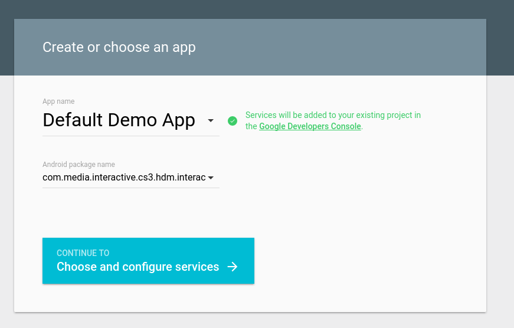
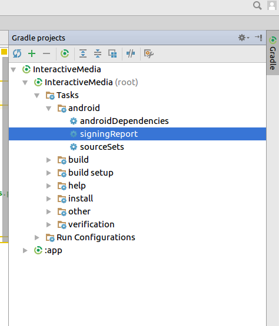
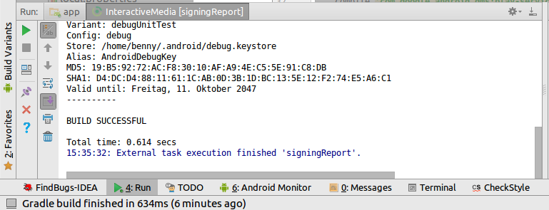
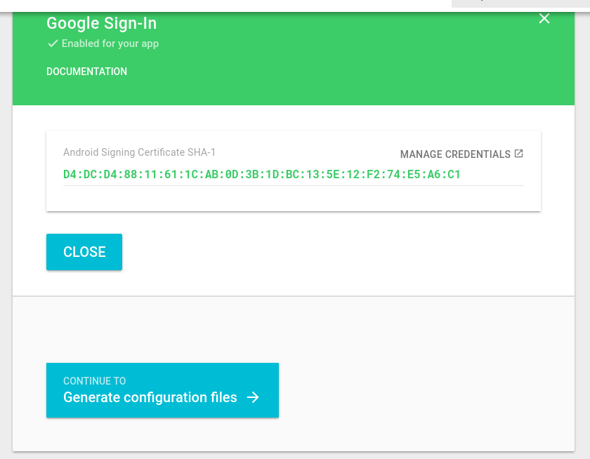
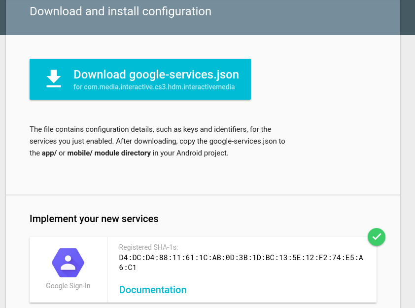
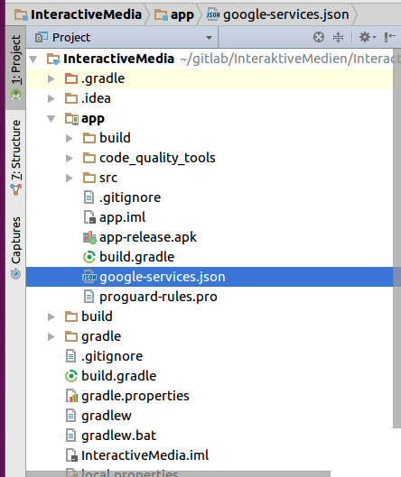

## Ausführen der Android-Anwendung
Damit der Google-SignIn funktioniert, muss zunächst für jede Developer-Maschine eine google-services.json erzeugt werden.
Hierfür diesen Link besuchen https://developers.google.com/mobile/add?platform=android&cntapi=signin&cntapp=Default%20Demo%20App&cntpkg=com.media.interactive.cs3.hdm.interactivemedia&cnturl=https:%2F%2Fdevelopers.google.com%2Fidentity%2Fsign-in%2Fandroid%2Fstart%3Fconfigured%3Dtrue&cntlbl=Continue%20with%20Try%20Sign-In


Als Package-Name sollte 'com.media.interactive.cs3.hdm.interactivemedia' gesetzt sein, ansonsten manuell nachtragen.
Der AppName kann beliebig gewählt werden.
Nun wird ein SHA-1 Hash von unserer App aus Android Studio benötigt.

 Hierfür wählt man in Android Studio am rechten Bildschirmrand den Punkt Gradle aus. Hier kann nun unter InteractiveMedia (root) > Tasks > android  der signingReport ausgewählt werden. Diesen mittels Doppelklick ausführen.

  Nun sollte sich die Gradle-Console öffnen und einige Zeilen an Output generiert werden. Darunter ist ebenfalls der SHA-1 Hash zu finden, der in die Website kopiert werden muss. Falls keine Ausgabe generiert wird, kann es möglich sein, dass der Menüpunkt 'Toggle Tasks executions/text mode' noch ausgewählt werden muss.
  
Nun kann auf der Website mit einem Klick auf 'Generate configuration files' fortgefahren werden. Anschließend kann die google-services.json Datei heruntergeladen werden.

 Diese muss in das 'app' Verzeichnis abgelegt werden.

  Mit einem Android-Emulator, der die Google Services installiert hat, kann jetzt ein Google-SignIn vorgenommen werden.

## Ausführen der Backend-Anwendung
Öffnen des Projekts
```bash
#Starten der Anwendung
docker-compose up --build
```
Anschließend Browser öffnen (localhost:8080)

Default-User:
Name: admin
Passwort: admin

## Testing

``` bash

# run docker container
docker-compose up --build

# on another terminal run unit tests
docker-compose run backend npm test

```

## Project Structure
* `backend`
* `backend/JSONSchema` - folder with custom JSON-Validation files
* `backend/modules` - folder with custom modules
* `backend/test` - folder with custom test modules
* `backend-test`
* `data`
* `frontend`
* `frontend/assets` - folder with static assets (images)
* `frontend/components` - folder with custom `.vue` components
* `frontend/css` - custom app CSS styles
* `frontend/pages` - app `.vue` pages
* `frontend/main.js` - main app file where to include/import all required libs and init app
* `frontend/routes.js` - app routes
* `frontend/app.vue` - main app structure/component

## Projekt-Mitglieder
Benjamin Kowatsch (bk095)
Pirmin Rehm (pr057)
Alexander Schübl (as333)
Alexander Wallrabenstein (aw145)
Maximilian Bischoff (mb295)
