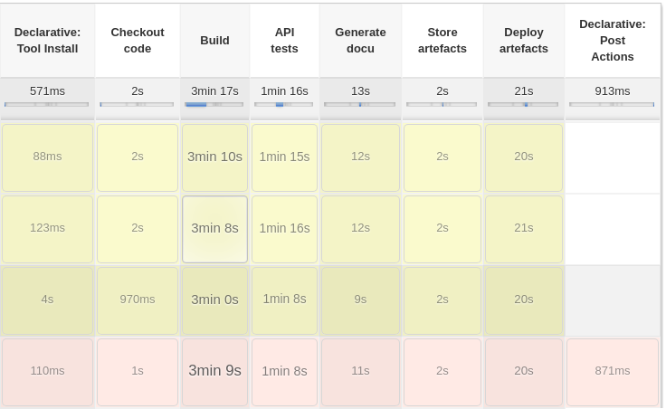
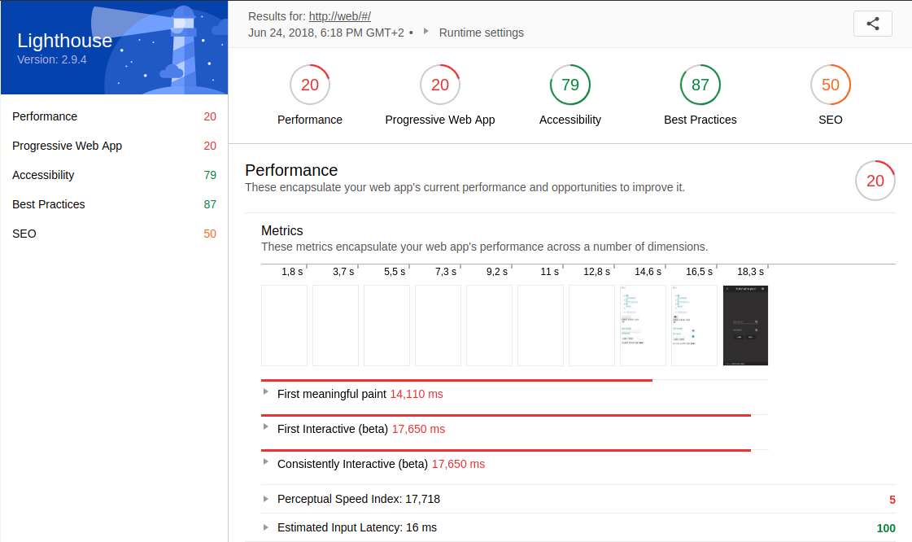
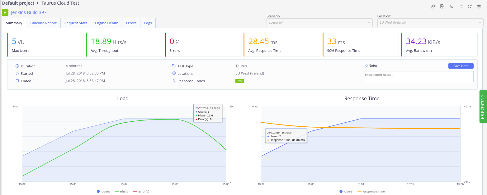
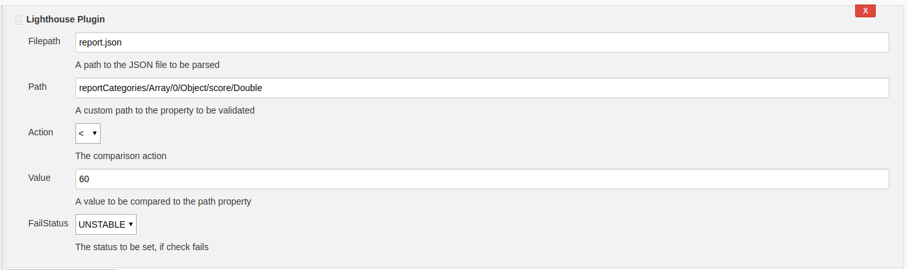
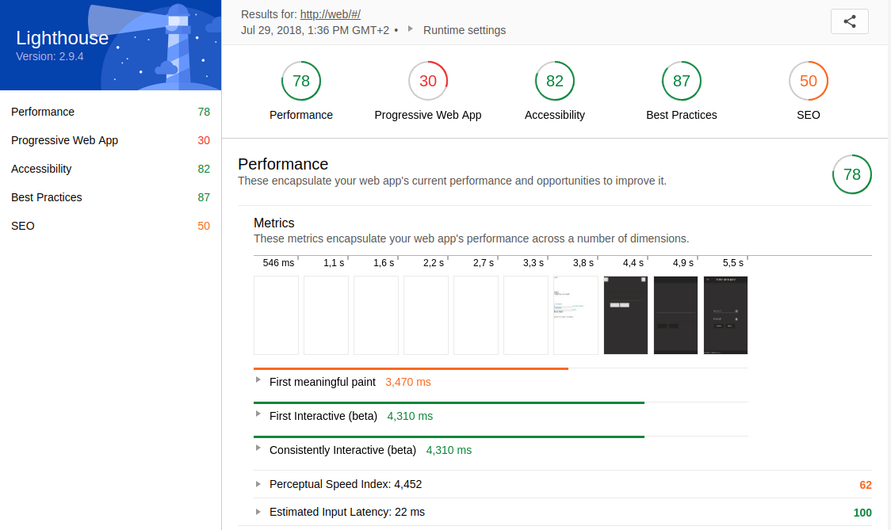
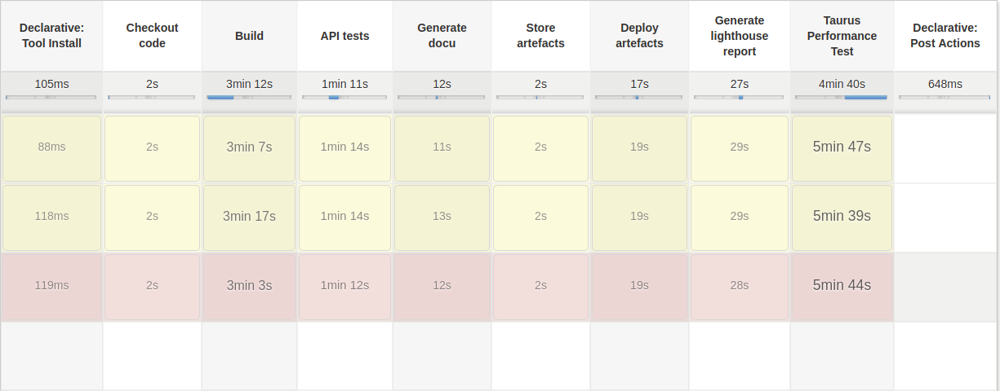
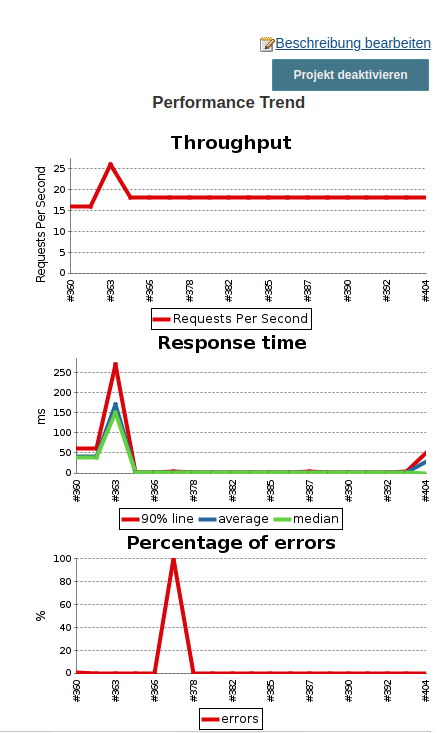

# Web Performance Optimization for Continuous Deployment 
The performance of websites today is a decisive factor in how many users visit them and thus how much money can be earned from them. The impact of this fact is further enhanced by the widespread use of mobile devices and the speed of the mobile Internet.
To counteract the development of heavyweight websites, web performance optimizations should be integrated into the development process as early as possible.
As part of this blog post I want to address this topic in the context of Continuous Deployment using the following sections.

- [Motivation](#motivation)
- [Implementation](#implementation)
- [Results](#results)
- [Conclusion](#conclusion)

## Motivation
<a name="motivation"></a>
To avoid starting a continuous deployment environment from scratch, I used a previous project as a basis.
The Debts² project is a distributed application used to jointly manage expenses in groups. The application consists of the following three components.

- A backend server
- A native Android app
- A simple admin frontend

The [backend](http://cloudproject.mi.hdm-stuttgart.de:8081/v1/status) was hosted on a server of the HdM. Using this server, both the [admin frontend](http://cloudproject.mi.hdm-stuttgart.de/#/) and the [Jenkins](https://jenkins.io/) could be hosted as a continuous deployment environment. Within this environment the native Android app was also built. Additional resources related to debts² can be found [here](https://drive.google.com/open?id=1-nLpRGqmhLp7_h3A1u77xGPB9ETMatoa) for further information.
So, the Jenkins and the admin frontend created the starting point for the integration of Web performance optimizations in a continuous deployment environment.
To enable a before-and-after comparison, a snapshot of the admin frontend and the Jenkins [pipeline](https://jenkins.io/doc/book/pipeline/) was taken first. In order to measure the performance of the admin frontend a [lighthouse](https://developers.google.com/web/tools/lighthouse/) report was generated. The following figures represent the initial state of the Jenkins pipeline and the performance of the admin frontend.

<a name="initialpipeline"></a>

|  |
| :--: |
| *Figure 1: Initial pipeline snapshot* |  

|  |
| :--: |
| *Figure 2: Initial lighthouse report* |  

Based on this initial status survey, I have formulated the following goals.

- Extend the Jenkins pipeline to automatically measure the performance of the admin frontend and modify its pipeline status accordingly
- Make use of the measurements to optimize the performance of the admin frontend

In the context of this blog entry, the former is the main goal. The second serves to illustrate what the benefits of the first goal could look like, where many websites still have optimization potential, and what actions are necessary for this.
## Implementation
<a name="implementation"></a>
All source code is available at [GitHub](https://github.com/BenjaminKowatsch/InteractiveMedia). A presentation on this topic is available [here](https://docs.google.com/presentation/d/1zSLEMyPWvWehIqo3YlQUSIo7wDnUUFUUTjbfS97cn3g/edit?usp=sharing). Code concerning this blog post can be found in the following subdirectories of the mono repository.

- [Jenkins](https://github.com/BenjaminKowatsch/InteractiveMedia/tree/master/Jenkins)
- [lighthouse](https://github.com/BenjaminKowatsch/InteractiveMedia/tree/master/lighthouse)
- [lighthouse-plugin](https://github.com/BenjaminKowatsch/InteractiveMedia/tree/master/lighthouse-plugin)
- [frontend](https://github.com/BenjaminKowatsch/InteractiveMedia/tree/master/frontend)

The following course of action is based on my previously depicted self-defined goals. 

### Goal 1: Extend the Jenkins pipeline

In order to achieve the first goal, I decided to integrate a lighthouse report generation into the pipeline using [Docker](https://www.docker.com/) and [Docker Compose](https://docs.docker.com/compose/).
After some research I found multiple possible options to proceed.

1. Making use of this [web service](https://builder-dot-lighthouse-ci.appspot.com/ci?format=html&amp;key=123&amp;url=https://example.com/) to generate the lighthouse report while providing the URL to be tested as a URL parameter.
2. Running a Docker container on the Jenkins server to generate the report locally.
3. Running an own web service using another server.

Due to the minimal effort of option one, I decided to try the second one and declare the first one to my fallback solution. Until I arrived at a working solution, I had to go through some attempts.
First, I wanted to make use of a preexisting Docker image. After trying several images without success, I was able to run the image [lighthouse-ci](https://hub.docker.com/r/kmturley/lighthouse-ci/) on my local system. Next, it should run on the Jenkins server. Unfortunately, the image could not be executed on the server due to missing UI. The container couldn't also be executed using its settings for the headless mode of google chrome.
As a further try, I installed lighthouse and chrome on the server directly without Docker to reduce complexity. However, this attempt failed because lighthouse waited for chrome on a specific port, although it had already started in headless mode. In hindsight, I have to say that at this point the information about starting chrome with remote debugging would have saved a lot of effort.
For the last attempt I organized a remote server with UI in order to have all prerequisites to make it work.
Unfortunately, when starting google chrome I received a misleading error regarding no display connection being established. To overcome this difficulty, I took a closer look at the google chrome headless mode and how it interacts with lighthouse. I learned that chrome must be started in headless mode using remote debugging on a specific port in order to work with lighthouse.
Based on this insight I was able to create a local solution first. Subsequently, I managed to build an own Docker image based on the [chrome-headless-trunk](https://hub.docker.com/r/alpeware/chrome-headless-trunk/) by installing [Node.js](https://nodejs.org/en/download/package-manager/#debian-and-ubuntu-based-linux-distributions) and the [lighthouse npm package](https://www.npmjs.com/package/lighthouse) manually. The resulting Dockerfile is accessible [here](https://github.com/BenjaminKowatsch/InteractiveMedia/blob/master/lighthouse/Dockerfile).
Initially, I thought that the generation of the lighthouse report would be integrated into the pipeline via a separate build stage at the [Jenkinsfile](https://github.com/BenjaminKowatsch/InteractiveMedia/blob/master/lighthouse/Dockerfile). By using this Dockerfile in combination with Docker Compose [health checks](https://docs.docker.com/compose/compose-file/compose-file-v2/#healthcheck), I was able to line up the build and run of my custom Docker lighthouse container into the execution order of the build and run of the actual distributed application. The resulting output contains only a few lines of code at the [Docker Compose file](https://github.com/BenjaminKowatsch/InteractiveMedia/blob/master/docker-compose.local.yml). Additionally, no separate build stage is required.
Next, to put the lighthouse report at disposal at Jenkins I used the Jenkins [HTML Publisher Plugin](https://wiki.jenkins.io/display/JENKINS/HTML+Publisher+Plugin) to publish the HTML version of the lighthouse report.
Therefore I created a new stage at the Jenkinsfile.
To ensure the performance of the website under load, an additional stage was appended. By the means of [Taurus](https://gettaurus.org/), the Automation-friendly framework for Continuous Testing, load tests can be specified in a declarative manner by using a YAML-file. Simply put, the file consists of the following five sections.

- Scenarios
- Execution
- Reporting
- Provisioning
- Modules

The section scenarios depicts actual HTTP requests to be executed.
The section execution describes load test metrics such as a concurrency, locations, scenario, ramp-up and hold-for time. The subsection scenario links one scenario to be realized.
In the section [reporting](https://gettaurus.org/docs/Reporting/) consists of modules aggregating the results of the executors and feeding them into a report. By making use of the module [passfail](https://gettaurus.org/docs/PassFail/) rules for certain metrics like the average response or latency time can be defined to either let the test succeed or fail.
To perform the load tests in the [cloud](https://gettaurus.org/docs/Cloud/), the provisioning section must be set correctly. By default Taurus uses local provisioning.
BlazeMeter's free plan allows one location only for cloud testing. So, be sure to set only one location, when enabling cloud provisioning.
In the module section, you can provide the credentials and further settings to connect to BlazeMeter or other Cloud Testing platforms. In addition, data worth protecting can be defined at the module section of the .bzt-rc file of the current user. A more comprehensive breakdown regarding the YAML-file can be found [here](https://gettaurus.org/docs/YAMLTutorial/)

In conjunction with Taurus I harnessed the Testing platform [BlazeMeter](https://www.blazemeter.com/) for load test execution. In order to connect the Jenkins server to BlazeMeter the [Taurus command line tool *bzt*](https://gettaurus.org/docs/CommandLine/) has to be [installed](https://gettaurus.org/install/Installation/) on the Jenkins host machine. Make sure to install the version [1.12.1](https://github.com/Blazemeter/taurus/blob/master/site/dat/docs/Changelog.md#112111-jul-2018) to avoid the AssertionError: monitoring bug for cloud tests. A well structured tutorial containing detailed Information about the installation is available [here](https://dzone.com/articles/how-to-run-a-taurus-test-through-jenkins-pipelines). Next, the Taurus command line tool *bzt* has to connect to BlazeMeter. Therefore an API key and API secret has to be generated at BlazeMeter's account settings. To avoid exposing the credentials, it's recommended to write these into the .bzt-rc file at the home directory of the Jenkins user. Afterwards it's ready for use in the Jenkinsfile. Invoking a report to be accessed at BlazeMeter the option 'report' has to be applied. To better distinguish the load tests, the Jenkins build number can also be integrated into the test name. During each build process, a link to the newly created load test report on BlazeMeter is now displayed in the console. In the following picture an overview of a sample report of a cloud test is depicted.

|  |
| :--: |
| *Figure 3: Overview Cloud Test on BlazeMeter* |  

For the purpose of influencing the pipeline status according to the results of the lighthouse report, I initially created a script section in the Jenkinsfile. Using the JSON version of the lighthouse report certain values could be extracted. Analog to the Taurus module passfail certain rules could be formulated by the means of these values. Depending on whether these rules apply or not, the pipeline status has been set. Although this solution worked well, the Jenkinsfile quickly became confusing because declarative code was mixed with functional code.

To counteract this problem, I decided to develop my own Jenkins plugin for it. The starting point for me was [this article](https://wiki.jenkins.io/display/JENKINS/Plugin+tutorial#Plugintutorial-CreatingaNewPlugin) in the Jenkins Wiki. Additionally, this [link](https://jenkins.io/doc/developer/plugin-development/pipeline-integration/) was especially helpful for the implementation of the pipeline support. Instead of using the empty-plugin archetype, I used the [hello-world-plugin archetype](https://mvnrepository.com/artifact/io.jenkins.archetypes/hello-world-plugin/1.4) to better understand the structure of it.
The goal of the Jenkins plugin is very straightforward. As an input it receives a JSON lighthouse report, a path to a nested property inside the JSON file, a limiting value, a type of comparison and a pipeline status. In this way, the nested value can be found in the JSON file and compared with the limiting value. When the expected comparison is met, the pipeline status is set to success, otherwise the predefined pipeline status is set. To ensure correct execution, I have defined some unit tests. The most challenging part was the realization of the recursive descent to the nested property using its path. A working example is depicted in the following code snippet.
```groovy
step([$class: 'LighthousePlugin',
filepath: 'report.json',
// Performance score
path: 'reportCategories/Array/0/Object/score/Double',
action: 'lt',
value: '60',
failStatus: 'UNSTABLE'])
```
For my initial concept I wanted to pass an array of input data, so multiple rules could be checked in sequence. However, due to little documentation I wasn't able integrate an extendable list into the [UI Jelly](https://wiki.jenkins.io/display/JENKINS/Basic+guide+to+Jelly+usage+in+Jenkins). Therefore, I simplified the concept to only validate one rule every plugin call. The plugin can also be integrated into Free Style projects. It is configured as a build step and may be executed. The following figure illustrates the previous configuration with the pipeline as a build step using UI.

|  |
| :--: |
| *Figure 4: Ligthouse plugin UI configuration* |  

The possible values for the data fields are comprehensible and can be read as well as the whole plugin source code more precisely [here](https://github.com/BenjaminKowatsch/InteractiveMedia/tree/master/lighthouse-plugin).

### Goal 2: Optimize the performance

Now that my first goal was achieved, I could focus on optimizing the admin frontend. Based on the [results of the initial lighthouse report](http://htmlpreview.github.io/?https://raw.githubusercontent.com/BenjaminKowatsch/InteractiveMedia/master/lighthouse_reports/old_lighthouse_reports/report.report.html) a number of things were in need of improvement. Now I have listed a subset of the most important optimizations for me in the following.

1. Image and video compression
2. Gzip compression
3. Uglify/Minify source files
4. Unused CSS
5. Critical CSS path
6. Cache Control
7. SSL certificates

Due to the simple use case of the admin frontend image and video content is not available. Therefore techniques for image and video compression could not be applied.
On the other hand the gzip compression at the nginx could be activated. For this purpose, a [new file](https://github.com/BenjaminKowatsch/InteractiveMedia/blob/master/frontend/nginx/compression.conf) was simply created in the configuration of nginx, which sets the compression for the different MIME types.
Next, minifying or uglifying the source code files was done via [webpack](https://webpack.js.org/). Unfortunately, an older version and a lot of plugins were used. Therefore, this task, which previously seemed so simple, became more difficult than expected. In order to minify HTML-files the minify property of the [HtmlWebpackPlugin](https://webpack.js.org/plugins/html-webpack-plugin/) had to be set. Minifying CSS-files was configured by the use of a [style-loader](https://webpack.js.org/loaders/style-loader/). JS-file uglification also required the use of an additional plugin called [UglifyjsWebpackPlugin](https://webpack.js.org/plugins/uglifyjs-webpack-plugin/).
Removing unused CSS can be very performance-enhancing, but also very dangerous, as initially invisible code can be removed, especially in single page applications. To remove unnecessary CSS automatically, there are several free websites like [jitbit](https://www.jitbit.com/unusedcss/).
It requires only an URL as input and starts to analyze the given website. The result is a list of unused CSS selectors. However, after removing these selectors you should check manually if the styles of the sub pages of your single page application are still functional. Of course, this is not a viable solution for larger scaled websites, as the risk of accidentally removing code that is needed later is too high. In such cases, it is best to eliminate unnecessary code during the development, e.g. through code reviews, or possibly fall back on more high-quality and possibly proprietary tools.
In order to obtain a rapid first meaningful paint a critical CSS path is crucial. Online tools like the ones from [sitelocity.com](https://www.sitelocity.com/critical-path-css-generator) or [jonassebastianohlsson.com](https://jonassebastianohlsson.com/criticalpathcssgenerator/) are also available for this purpose. I tried both and noticed that the generated internal stylesheets are identical. In addition, sitelocity.com advises you to load the remaining CSS files asynchronously using JavaScript. This prevents a CSS file in the head tag to be loaded in a blocking manner.
Caching data can be very performance-enhancing, but can also limit the functionality of the website if used incorrectly. Caching should therefore be used carefully. Adding a cache control header is fairly easy with the [ngx_http_headers_module module](http://nginx.org/en/docs/http/ngx_http_headers_module.html). An expiration date can be assigned to each MIME type or a location by the means of a simple key-value mapping.
Finally, I intended to convert the individual system components to HTTPS in order to comply with today's minimum security requirements. I used self-signed certificates. Using an intermediate docker container, a new certificate could be generated in the multi-stage build and integrated in nginx, for example. In the backend, the inclusion of a certificate has become tougher due to the fact that the certificate had to be in a certain format as a result of the older Node.js version 6. Unfortunately, after a functioning state was reached, I had to realize that the lighthouse report could no longer be created. The reason for this is the self-signed certificate, whose error messages can usually be ignored via the flag ```--ignore-certifcate-errors```. Unfortunately, this flag has no effect in conjunction with the chrome headless mode, as stated [here](https://github.com/GoogleChrome/lighthouse/issues/559). This is the reason why the final version of the source code does not include SSL support. Alternatively, this problem could have been overcome with a correctly signed certificate. Due to time constraints, this solution could no longer be pursued.

## Results
<a name="results"></a>
Since the performance and condition of the pipeline were measured initially, it is now possible to measure again and compare the results.
First, we look at the lighthouse reports. The following figure depicts the final result of the lighthouse report, which is fully available [here](http://htmlpreview.github.io/?https://raw.githubusercontent.com/BenjaminKowatsch/InteractiveMedia/master/lighthouse_reports/report.report.html).

|  |
| :--: |
| *Figure 5: Optimized lighthouse report* |  

Compared to the [initial report](http://htmlpreview.github.io/?https://raw.githubusercontent.com/BenjaminKowatsch/InteractiveMedia/master/lighthouse_reports/old_lighthouse_reports/report.report.html), the optimizations described in the previous section achieved performance improvements of 58 points, 10 points in PWA, and 3 points in Best Practices.
These reports were created on a local computer for better comparability, since if we take a look at the [lighthouse report generated by Jenkins](http://cloudproject.mi.hdm-stuttgart.de:8080/job/Master-BuildDeploy-JohnnyDebt/Lighthouse_report/), we notice that the performance rating is significantly inferior.
The explanation for this is the performance gap of the computers, especially since the Jenkins server is under greater load due to the execution of the backend, frontend and the database of the application.
To avoid this problem, the generation of the lighthouse report could be swapped out onto a dedicated server so that it produces consistent results.
Nevertheless, I find the increase in performance that I have achieved with the optimizations more than sufficient. Without integrating the performance measurements into the distributed application and thus also into the Continuous Deployment pipeline, I would not have obtained regular feedback to constantly improve it.
Second, a closer look at the Jenkins pipeline. The subsequent image illustrates the final status of the Jenkins pipeline.

|  |
| :--: |
| *Figure 6: Final Jenkins snapshot* |  

In contrast to the [initial snapshot](#initialpipeline), the new build steps stand out instantly. These ensure that both the lighthouse report is generated and the load test is performed, but they also tremendously extend the execution time. The primary cause for this increase of execution time is the load test. Load tests are considered as integration tests and therefore should not be executed every build. To abbreviate the time of execution, the load test could be conducted less frequently depending on a conditional manually set.
For each build that executes a load test, a new record is created in a [performance trend](http://cloudproject.mi.hdm-stuttgart.de:8080/job/Master-BuildDeploy-JohnnyDebt/performance/) via the BlazeMeter Jenkins plugin, allowing you to view the performance curve of the load tests during the development process. The following figure displays the performance trend of my Jenkins server as an instance.

|  |
| :--: |
| *Figure 7: Jenkins BlazeMeter Performance Trend* |  

On the other hand, the lighthouse report generation is lightweight and has a rapid execution time. By means of configuration, the scope of the audits can be limited, so that the generation proceeds even faster.
The lighthouse plugin I created is extremely compact and small. Since it is based for the most part on the hello-world-plugin archetype, it probably still contains a few unnecessary files. So it could be possible to refactor them. Additional optimization opportunities would be to support arrays of rules. This way, the JSON report file would have to be parsed only once. More detailed information on the Jenkins pipeline you will find [here](http://cloudproject.mi.hdm-stuttgart.de:8080/job/Master-BuildDeploy-JohnnyDebt/).

## Conclusion
<a name="conclusion"></a>
So far, we have focused on the incentives, realization and outcome of Web Performance Optimization for Continuous Deployment environments using a concrete scenario. I would like to conclude this post by identifying the challenges that will most likely be encountered if you are also aiming for similar goals and highlighting opportunities to address them.

The integration of the lighthouse report into a Docker container or on my host machine of the Jenkins server proved to be complicated due to missing GPU and UI. Especially as there was less information to obtain about the virtualization software of the virtual machine and thus possible conflicts for lighthouse's requirements could be excluded. Therefore, my fundamental recommendation is to familiarize yourself with the target environment and the needs of lighthouse or comparable software. If possible, keep the target environment as lean as possible so that if errors occur, they are easy to reproduce and fewer conflicts may arise with other software. Through this learning I have dealt more closely with the individual components of lighthouse and have gradually worked out an individual solution. Although this took longer, I got a more comprehensive understanding of how lighthouse works compared to just using a Docker container.

During the development of the Jenkins plugin, the biggest challenge was to get an overview of the individual units and their interaction. Especially the special use case that the plugin is supposed to be compatible with the pipeline plugin made it harder to search for samples and documentation. Also the documentation for the Jelly UI components regarding the data binding was not intuitive, which is why I could not realize the support for arrays as rules by now.
As a tip I can only refer to the links I mentioned before. There you will find a detailed description of the development of a Jenkins plugin with pipeline support.

While optimizing the admin frontend the work flow with webpack was challenging. Especially as an older version as well as many dependencies were leveraged, I was able to obtain an overview more difficult. In addition, I have noticed that certain dependencies offer identical functions, but these occasionally conflict. As a result, it took me significantly more time to integrate the optimizations. To avoid this problem in the future, it would be advisable to use a current version and to minimize the number of dependencies in advance during development.

After all, the automation of web performance measurements is an extensive and demanding task. I am aware that Debts² was not an ideal starting point, since the distributed application already existed before the pipeline was enhanced with the web performance measurements.
Nevertheless, I was able to point out that it is also worthwhile to establish this in more advanced applications.
What I find particularly fascinating is the idea that by using a solution described in this post in software projects, non-functional requirements regarding web performance may directly be stored in the pipeline in the form of rules. Thus these are constantly validated and displayed to the development team.

Finally, I would like to emphasize that the measurement of web performance as part of a continuous deployment system itself only points to grievances or best practices. The value of such a solution depends heavily on the resulting business value, commitment and acceptance of the development team.